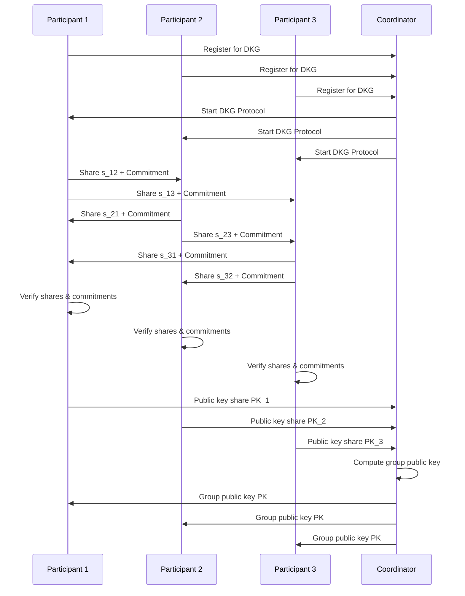
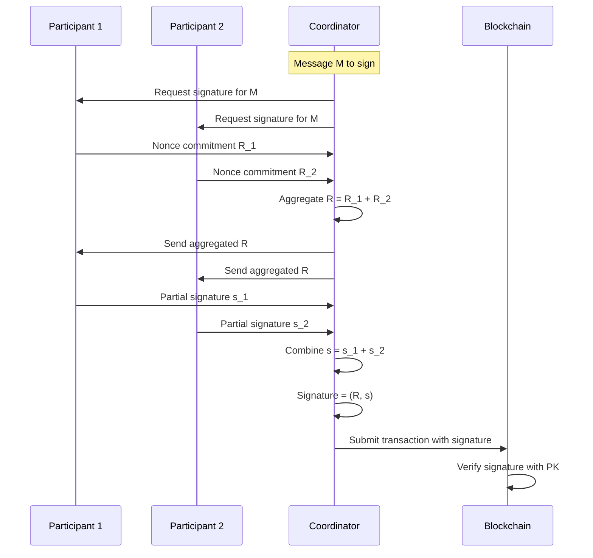

# Production-Grade Multi-Party Computation (MPC) Implementation

A secure, scalable Web3-native implementation of Multi-Party Computation protocols for distributed key management and secure computation.

## 🏗️ Architecture Overview

```
                        MPC System Architecture
┌──────────────────────────────────────────────────────────────────┐
│                                                                  │
│  ┌──────────────┐   ┌──────────────┐   ┌──────────────┐          │
│  │ Participant  │   │ Participant  │   │ Participant  │          │
│  │     #1       │   │     #2       │   │     #3       │          │
│  └──────┬───────┘   └──────┬───────┘   └──────┬───────┘          │
│         │                  │                  │                  │
│         └────────────┬─────┘────────┬─────────┘                  │
│                      │              │                            │
│              ┌───────▼──────────────▼───────────┐                │
│              │        MPC Protocol              │                │
│              │         Coordinator              │                │
│              └───────┬───────────────┬──────────┘                │
│                      │               │                           │
│          ┌───────────▼─────┌─────────▼───────┐                   │
│          │                 │                 │                   │
│  ┌───────▼───────┐ ┌───────▼───────┐ ┌───────▼─────┐             │
│  │    DKG        │ │    TSS        │ │   Shamir    │             │
│  │  Protocol     │ │  Signing      │ │   Secret    │             │
│  └───────────────┘ └───────────────┘ │   Sharing   │             │
│                                      └─────────────┘             │
│                                                                  │
│   ┌─────────────────────────────────────────────────────────┐    │
│   │             Distributed Storage Layer                   │    │
│   ├─────────────┬─────────────┬─────────────────────────────┤    │
│   │   AWS S3    │ Cloudflare  │    In-Memory Storage        │    │
│   │ (with KMS)  │    R2       │                             │    │
│   └─────────────┴─────────────┴─────────────────────────────┘    │
│                                                                  │
└──────────────────────────────────────────────────────────────────┘
```

## 🚀 Features

### Core Cryptographic Protocols
- **Distributed Key Generation (DKG)**: Pedersen DKG for threshold key generation
- **Threshold Signatures (TSS)**: Support for threshold ECDSA/EdDSA signatures  
- **Shamir Secret Sharing**: Enhanced implementation with large field support
- **Zero-Knowledge Proofs**: Schnorr proofs, range proofs, and share verification

### Security Features
- **End-to-end encryption** for all shares at rest
- **Secure random generation** using OS entropy
- **Proactive secret sharing** for key refresh
- **Multi-cloud distribution** for resilience
- **Hardware security module (HSM)** support via AWS KMS
- **Zero-knowledge proof verification** for all protocol steps

### Storage & Infrastructure  
- **Multi-provider support**: AWS S3, Cloudflare R2, In-memory
- **Geographic distribution** across regions
- **Automatic failover** and redundancy
- **TTL-based expiration** for temporary shares
- **Encrypted metadata** storage

## 📋 MPC Protocol Flow

### Phase 1: Distributed Key Generation



### Phase 2: Threshold Signing



## 🛠️ Installation

### Prerequisites
- Rust 1.70+ 
- Node.js 18+ (for Cloudflare Workers)
- AWS CLI configured (optional)
- Cloudflare Wrangler CLI

### Setup

```bash
# Clone the repository
git clone https://github.com/yourusername/multi-party-computation.git
cd multi-party-computation

# Install dependencies
cargo build --release

# Install Node dependencies for Cloudflare Workers
npm install

# Configure environment variables
cp .env.example .env
# Edit .env with your configuration
```

### Environment Variables

```env
# AWS Configuration
AWS_S3_BUCKET=mpc-shares-bucket
AWS_KMS_KEY_ID=your-kms-key-id
AWS_REGION=us-west-1

# Cloudflare Configuration  
CLOUDFLARE_ACCOUNT_ID=your-account-id
CLOUDFLARE_API_TOKEN=your-api-token
SHARES_BUCKET=your-r2-bucket
SHARES_METADATA=your-kv-namespace

# MPC Configuration
MPC_THRESHOLD=3
MPC_TOTAL_PARTICIPANTS=5
MPC_SESSION_TIMEOUT=3600
```

## 🧪 Testing

### Run Unit Tests
```bash
cargo test
```

### Run Integration Tests
```bash
cargo test --test integration_tests
```

### Run Benchmarks
```bash
cargo bench
```

### Test Coverage
```bash
cargo tarpaulin --out Html
open tarpaulin-report.html
```

## 📊 Performance Benchmarks

| Operation | Time (ms) | Throughput |
|-----------|-----------|------------|
| DKG (5 participants) | 120 | 8.3 ops/sec |
| Threshold Sign (3-of-5) | 45 | 22.2 ops/sec |
| Shamir Split (256-bit) | 2.3 | 434 ops/sec |
| Shamir Combine (3 shares) | 1.8 | 555 ops/sec |
| ZKP Generation | 0.9 | 1111 ops/sec |
| ZKP Verification | 0.6 | 1666 ops/sec |

## 🔐 Security Considerations

### Threat Model
- **Honest-but-curious adversaries**: Protocol is secure against passive adversaries
- **Byzantine failures**: Tolerates up to (n-1)/2 malicious participants
- **Network attacks**: All communication is encrypted with TLS 1.3
- **Storage compromise**: Individual share compromise doesn't reveal secret

### Security Measures
1. **Cryptographic security**:
   - 256-bit security level
   - Curve25519 for elliptic curve operations
   - SHA3-256 for hashing
   - ChaCha20-Poly1305 for authenticated encryption

2. **Operational security**:
   - Regular key rotation (daily by default)
   - Audit logging for all operations
   - Rate limiting on API endpoints
   - IP allowlisting for participants

3. **Infrastructure security**:
   - Multi-region deployment
   - Hardware security module integration
   - Zero-trust network architecture
   - Automated security scanning

## 🚢 Deployment

### Deploy to Cloudflare Workers

```bash
# Build the Worker
npm run build

# Deploy to Cloudflare
wrangler publish

# Verify deployment
curl https://your-worker.workers.dev/health
```

### Deploy to AWS Lambda

```bash
# Build for Lambda
cargo lambda build --release

# Deploy with SAM
sam deploy --guided
```

### Docker Deployment

```bash
# Build Docker image
docker build -t mpc-service .

# Run container
docker run -p 8080:8080 \
  -e AWS_S3_BUCKET=your-bucket \
  -e MPC_THRESHOLD=3 \
  mpc-service
```

## 📖 API Documentation

### POST /vault
Store a secret using MPC

**Request:**
```json
{
  "user_pubkey": "5GrwvaEF5zXb26Fz9rcQpDWS57CtERHpNehXCPcNoHGKutQY",
  "encrypted_private_key": "base64_encrypted_key",
  "metadata": {
    "threshold": 3,
    "total_shares": 5,
    "regions": ["us-west-1", "eu-west-1"],
    "key_version": 1
  },
  "signature": "signature_base58"
}
```

**Response:**
```json
[
  {
    "provider": "Aws",
    "region": "us-west-1",
    "identifier": "shares/uuid/share-1"
  },
  // ... more storage locations
]
```

### GET /vault/:key_id
Retrieve shares for reconstruction

### POST /sign
Sign a transaction using threshold signatures

## 🏗️ Project Structure

```
multi-party-computation/
├── src/
│   ├── crypto/           # Cryptographic protocols
│   │   ├── mod.rs        # Core crypto utilities
│   │   ├── dkg.rs        # Distributed Key Generation
│   │   ├── mpc.rs        # MPC coordination
│   │   ├── shamir.rs     # Shamir Secret Sharing
│   │   ├── threshold_signatures.rs  # TSS implementation
│   │   └── zkp.rs        # Zero-knowledge proofs
│   ├── storage/          # Storage providers
│   │   ├── aws.rs        # AWS S3 with KMS
│   │   ├── cloudflare.rs # Cloudflare R2
│   │   └── memory.rs     # In-memory storage
│   ├── api/              # API routes
│   ├── processing/       # Business logic
│   └── lib.rs            # Entry point
├── tests/
│   ├── integration_tests.rs
│   └── crypto_tests.rs
├── Cargo.toml
└── README.md
```

## 📚 References

- [Shamir's Secret Sharing](https://en.wikipedia.org/wiki/Shamir%27s_Secret_Sharing)
- [Threshold Signatures Explained](https://www.binance.vision/security/threshold-signatures-explained)
- [Distributed Key Generation](https://eprint.iacr.org/2021/005.pdf)
- [MPC Alliance](https://www.mpcalliance.org/)

---
Built with ❤️ using Rust and modern cryptography